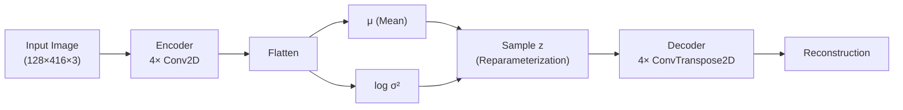
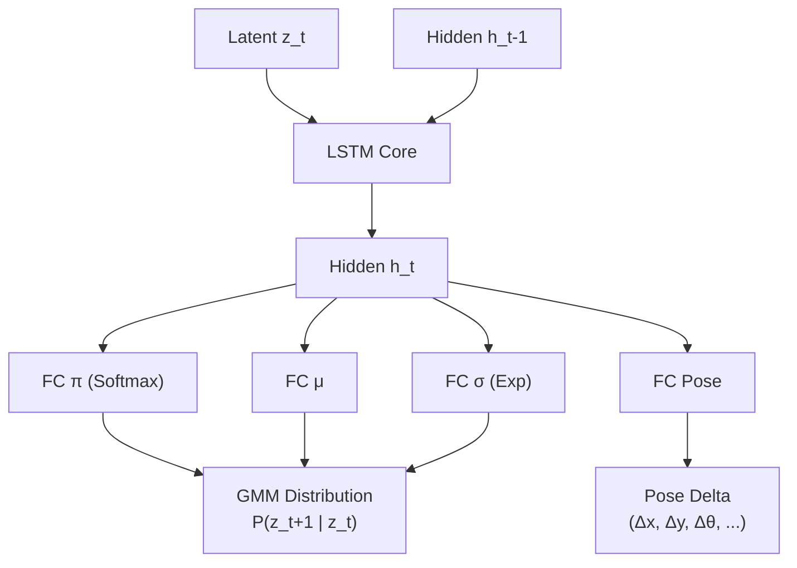

# Probabilistic World Models for Autonomous Driving

## 1. Introduction: The Brain in the Box

### The Challenge
**Autonomous agents are dangerous and slow to train in the real world.**

Imagine teaching a self-driving car through trial and error on a real highway. Each mistake is a potential catastrophe. We cannot afford to crash thousands of times just to learn to stay in a lane.

### The Solution: A Flight Simulator Inside the Agent's Brain
This project implements a **World Model**—a compressed, predictive model of the environment that allows a vehicle to "dream" potential futures and plan accordingly, entirely inside its own mind.

**Just as fighter pilots train in flight simulators before flying real jets, our agent trains in a simulated world it builds from experience.**

The system consists of two components working together:
1.  **Vision Model (VAE)**: The "Eyes"—compresses camera images into a latent representation $z_t$. Think of this as how you remember the screen in a video game, not pixel-by-pixel, but as meaningful features.
2.  **Memory Model (MDN-RNN)**: The "Physics Engine"—predicts what happens next based on past observations. This is the simulator that runs inside the agent's mind.

> [!IMPORTANT]
> The key innovation: Instead of training on expensive real-world interactions, the agent trains in its own imagined world.

---

## 2. Data: The KITTI Odometry Benchmark

### 2.1 Dataset Overview
We utilize the **KITTI Odometry Benchmark**, a standard dataset for autonomous driving research. It consists of 22 sequences of real-world driving data from Karlsruhe, Germany, containing:
*   **Stereo Images**: Left and right camera views (we use the left camera, 128×416 resolution).
*   **Ground Truth Poses**: High-precision GPS/IMU localization data (sub-centimeter accuracy).

### 2.2 The Pose Delta Insight: Learning the Derivative


A critical design choice is how we represent the vehicle's movement. The raw data provides **Absolute Poses** (Global X, Y, Z coordinates). However, training a model to predict absolute coordinates is fundamentally flawed—it will memorize the specific map rather than learn general driving dynamics.

Instead, we train the model on the **Derivative** of the position, or **Pose Deltas**:
$$
\Delta P_t = P_{t+1} - P_t
$$
*(Technically, we compute the relative transformation matrix between consecutive frames using $\Delta T_t = T_t^{-1} \cdot T_{t+1}$).*

**Why is this crucial?**

| Absolute Pose                          | Pose Delta                              |
| -------------------------------------- | --------------------------------------- |
| "I am at coordinate (500, 200)"        | "I am moving forward at 10 m/s"         |
| Specific to one map                    | Generalizes across all roads            |
| Unbounded distribution (squiggly line) | Stationary distribution (tight cluster) |
| Model memorizes the route              | Model learns physics of motion          |

**Visual Intuition**: 
- **Absolute coordinates**: Imagine plotting all GPS positions—you get a squiggly line that looks different for every drive.
- **Pose deltas**: Plotting all velocity vectors forms a tight cluster around "slow forward motion" with occasional turns. This pattern is **universal** to all driving.

> [!NOTE]
> This choice transforms the problem from "memorize this specific highway" to "learn how cars move in general."

---

## 3. Visual Compression: Variational Autoencoder (VAE)

### 3.1 Mathematical Formulation
The VAE learns a probabilistic mapping from the image space $x$ to a latent space $z$. We maximize the Evidence Lower Bound (ELBO):

$$
\mathcal{L}_{VAE} = \mathbb{E}_{q(z|x)}[\log p(x|z)] - \beta D_{KL}(q(z|x) || p(z))
$$

*   **Reconstruction Term** $\mathbb{E}[\log p(x|z)]$: Enforces that the latent code $z$ captures enough information to reconstruct the image. We assume a Gaussian likelihood, which leads to the Mean Squared Error (MSE) loss.
*   **Regularization Term** $D_{KL}$: Forces the learned distribution $q(z|x)$ to approximate a standard Normal prior $p(z) = \mathcal{N}(0, I)$. This ensures a smooth latent space suitable for sampling and interpolation.

### 3.2 Architecture



### 3.3 Implementation Details
The `ConvVAE` class in `src/models/conv_vea.py` implements the reparameterization trick to allow backpropagation through the stochastic sampling step:

```python
def reparameterize(self, mu, logvar):
    """
    The reparameterization trick: z = μ + σ * ε
    where ε ~ N(0, 1)
    This makes sampling differentiable.
    """
    std = torch.exp(0.5 * logvar)
    eps = torch.randn_like(std)  # Sample noise
    return mu + eps * std
```

## 3.4 VAE Results: Reconstruction vs. Hallucination


**Reconstruction (The Input)**


> [!note]
> **Medium Fidelity**: The model successfully captures lane curvature, car positions, and shadows.

<!-- slide -->
**Random Sampling (The Prior)**


> [!WARNING]
> **Low Fidelity**: Random samples drawn from the standard normal prior $\mathcal{N}(0, I)$ are noisy/blurry. This indicates the latent space is not perfectly continuous.


### The Observation
* **Random Sampling ($z \sim \mathcal{N}(0,I)$)**: Produces invalid/blurry states.
* **Implication**: The latent space has "holes"—regions where the VAE did not map any real training data.

### Does this hurt the Trajectory Prediction?
**Yes, it creates a stability risk.**

1.  **The Feedback Loop Danger**:
    * In "Dreaming" (Open Loop), we sample $z_{t+1}$ and feed it back into the RNN as the next input.
    * 
    * If the RNN predicts a $z$ that falls into a "hole" (off the data manifold), we are feeding the neural network an input it has never seen before (Out-Of-Distribution).

2.  **Garbage In, Garbage Out**:
    * Neural Networks behave unpredictably on Out-Of-Distribution data.
    * If $z$ is invalid $\rightarrow$ Hidden State $h$ becomes corrupted $\rightarrow$ **Pose Prediction becomes erratic.**

3. **Constraint**: Fixing the "holes" in the latent space requires a trade-off:
   *  **More Aggressive KL-Divergence**: This packs the space tighter but degrades reconstruction quality (the model ignores fine details).
   *  **GAN-based Decoder**: This forces sharpness but is unstable and too computationally expensive for a laptop to train reliably.

#### Conclusion
Even though we don't use the Decoder for driving, the **geometry** of the latent space matters.
* **Ideal**: A perfectly dense latent space (all $z$ are valid).
* **Reality**: Our space has gaps. If the "dream" falls into a gap, the physics simulation may diverge or collapse.

---

## 4. Latent Dynamics: MDN-RNN

### 4.1 Mathematical Formulation
The Memory Model predicts the probability distribution of the next latent state $z_{t+1}$ given the current state $z_t$ and hidden state $h_t$. Since the future is uncertain and **multi-modal**, we model it as a **Mixture of Gaussians (GMM)** using a Mixture Density Network (MDN).

$$
P(z_{t+1} | h_t) = \sum_{k=1}^K \pi_k(h_t) \mathcal{N}(z_{t+1} | \mu_k(h_t), \sigma_k(h_t))
$$

*   $\pi_k$: Mixing coefficients (probabilities of each Gaussian, sum to 1).
*   $\mu_k, \sigma_k$: Mean and variance of the $k$-th Gaussian component.

The loss function is the **Negative Log Likelihood (NLL)** of the true next state under this predicted distribution:

$$
\mathcal{L}_{MDN} = -\log \left( \sum_{k=1}^K \pi_k \exp \left( -\frac{(z_{t+1} - \mu_k)^2}{2\sigma_k^2} \right) \right)
$$

### 4.2 Architecture Explained
The **DreamerMDRNN** is composed of three distinct parts working in together:

1.  **The Memory (LSTM)**:
    *   Acts as the brain of the model. It receives the compressed visual information ($z_t$) and updates its internal hidden state ($h_t$).
    *   This hidden state represents the "context" of the drive—it remembers velocity, acceleration, and recent maneuvers.

2.  **The Vision Heads (MDN)**:
    *   Because the future is uncertain (e.g., a car might turn left OR right), we cannot predict a single future frame.
    *   Instead, we use a **Mixture Density Network (MDN)** to predict a *probability distribution* of possible futures.
    *   It outputs parameters for a Gaussian Mixture Model (GMM): Mixing coefficients ($\pi$), Means ($\mu$), and Variances ($\sigma$).

3.  **The Pose Head**:
    *   A simple linear layer that looks at the memory ($h_t$) and predicts the physical movement of the car ($\Delta x, \Delta y, \Delta z, \Delta roll, \Delta pitch, \Delta yaw$).



### 4.3 The Training Process
We train the model using a **Stateless** approach to ensure stability and efficiency.

1.  **Input Sequence**: We feed the model a short sequence of 5 frames (e.g., $t=0$ to $t=4$).
2.  **Forward Pass**:
    *   The LSTM processes these 5 frames sequentially.
    *   At each step, it predicts the *next* latent state ($z_{t+1}$) and the *next* movement.
3.  **Loss Calculation**:
    *   **Vision Loss (MDN)**: We check if the *actual* next frame ($z_{t+1}$) falls within the predicted probability distribution (high likelihood = good).
    *   **Pose Loss (MSE)**: We measure the Mean Squared Error between the predicted movement and the actual movement.
4.  **Backpropagation Through Time (BPTT)**:
    *   The error signal travels backwards through the 5-step sequence.
    *   It teaches the LSTM to update its memory gates, learning to pay attention to relevant features (like velocity changes or approaching turns).

### 4.4 Implementation Details
The loss function handles numerical stability using the **Log-Sum-Exp trick** (`torch.logsumexp`), which prevents numerical underflow when dealing with very small probabilities—a crucial engineering detail for stable training.

```python
# src/models/mdnrnn_pose.py

def loss_function(self, y_true_latent, ...):
    # ... (Calculation of log_prob for each Gaussian) ...
    
    # Log-Sum-Exp for numerical stability
    # Directly computing sum(exp(log_prob)) can underflow to 0
    # log(sum(exp(x))) = logsumexp(x) is numerically robust
    weighted_log_prob = log_pi + log_prob
    log_prob_total = torch.logsumexp(weighted_log_prob, dim=2)

    loss_mdn = -torch.mean(log_prob_total)
    return loss_mdn + (loss_pose * pose_weight)
```

> [!TIP]
> The `logsumexp` trick is essential: Computing $\log(\sum e^{x_i})$ directly can cause underflow/overflow. The stable version is $\max(x) + \log(\sum e^{x_i - \max(x)})$.

### 4.5 Training Strategy & Limitations
**Stateless Training with Windowing**:
We train the model on short, shuffled sequences (Window Size = 5) where the hidden state is reset at the start of each batch.
*   **Advantage**: Stabilizes gradients and allows for random sampling of the dataset (I.I.D. assumption).
*   **Limitation (Training-Inference Mismatch)**: The model is trained to have a "short-term memory" (5 steps) but is evaluated on long sequences (1000+ steps). This can lead to **drift** over time, as the model may not learn to manage long-term memory effectively.
*   **Future Work**: Implement **Truncated Backpropagation Through Time (TBPTT)** with state passing to allow the model to learn global map consistency.

### 4.6 The Fork in the Road: Why Probabilistic?


**The Paradox**: Driving physics is largely deterministic (Newton's laws). Why use a generative probabilistic model (MDN)?

**The Critical Insight**: The world is not deterministic from the agent's perspective.

Consider this scenario: You're approaching a yellow traffic light. The car in front of you will either:
- **Stop** (brakes hard)
- **Accelerate** (speeds through)

A deterministic model (e.g., simple MSE regression) predicts the **average** of these two behaviors:
- Predicted action: "Gentle deceleration"
- Real outcome: Collision (because the actual car did ONE of the extremes, not the average)

**Our MDN Solution**: Predict a **bimodal distribution** with two peaks:
$$
P(\text{future}) = 0.5 \cdot \mathcal{N}(\text{stop}) + 0.5 \cdot \mathcal{N}(\text{accelerate})
$$

> [!IMPORTANT]
> **The Analogy**: If a deterministic model sees a fork in the road, it averages "Turn Left" and "Turn Right" and drives straight into the tree. Our MDN sees two distinct safe paths and can choose one.

This is not just a theoretical concern—**multimodality appears everywhere**:
- Overtaking maneuvers (stay in lane vs. change lane)
- Intersection decisions (yield vs. go)
- Even small camera noise creates uncertainty in the latent space

### 4.7 The Concept of "Dreaming"
The true power of the World Model is **Latent Dreaming** (Closed-Loop Prediction).

| Open Loop (Testing)                    | Closed Loop (Dreaming)               |
| -------------------------------------- | ------------------------------------ |
| Feed ground truth images at every step | Feed the model its *own* predictions |
| Model constantly self-corrects         | Errors accumulate over time          |
| Evaluates short-term accuracy          | Tests long-term coherence            |

**The Dreaming Process**:
1.  $z_0$ (Real) $\rightarrow$ Model $\rightarrow$ Predicts $z_1$
2.  $z_1$ (Imagined) $\rightarrow$ Model $\rightarrow$ Predicts $z_2$
3.  ...
4.  $z_{100}$ (Imagined) $\rightarrow$ Model $\rightarrow$ Predicts $z_{101}$

This allows the agent to simulate infinite futures without seeing new data, enabling planning in a "dream" environment.

**Dreaming Result (Sequence 09)**:


> [!NOTE]
> **Drift Explained**: The blue line shows the "hallucinated" trajectory where the model feeds its own predictions back into itself. Notice how it diverges from ground truth (black) after ~50 meters. This is **accumulated error**—small prediction mistakes compound over time. For RL planning (which only needs 5-10 seconds lookahead), this is acceptable. For long-term map prediction, we would need state correction mechanisms.

### 4.8 Results: Trajectory Prediction

**Test Sequence 09 (Open-Loop Trajectory Integration)**:


**Key Observations**:
- ✅ **Short-term accuracy**: First 30 meters are nearly perfect
- ✅ **Physics coherence**: The dreamed trajectory obeys realistic motion (no teleportation or impossible turns)
- ⚠️ **Long-term drift**: After ~50 meters, the trajectory diverges due to accumulated errors

**Why does drift occur?**
- The model was trained on 5-frame sequences, not 1000-frame sequences
- Small errors in $z_t$ prediction propagate to $z_{t+1}$, then $z_{t+2}$, etc.
- This is analogous to dead reckoning in navigation—without GPS corrections, position estimates drift over time

**Why is this acceptable?**
- An RL agent only needs to plan ~5 seconds (20-30 frames) ahead
- The agent re-plans at every timestep using fresh, real observations
- The World Model doesn't need to predict the entire 10-minute drive—just the immediate future

---

## 5. Conclusion

This project demonstrates a functional World Model capable of:
1.  **Compressing** visual information into a meaningful latent space (VAE).
2.  **Learning** the probabilistic dynamics of the environment (MDN-RNN).
3.  **Dreaming** coherent future trajectories for short-term planning.

### The Bigger Picture
This architecture forms the foundation for **Model-Based Reinforcement Learning**, where an agent can:
- Train policies entirely within this "dream" environment (safe, fast, cheap)
- Plan optimal actions by simulating consequences before acting
- Learn from imagination rather than expensive real-world trial-and-error

### Future Directions
- Make a more realistic Dreaming environment by improving latent space
- Implement **Controller (C)**: Use the World Model to train an RL agent to drive
- Address drift with **state correction** or **longer training sequences**

---

## Anticipated Questions & Answers

**Q: Why did you use 5 Gaussians in the MDN?**
A: Empirical tuning. We tested $K \in \{3, 5, 7\}$. Five components provided the best balance between expressiveness (capturing multimodal distributions) and training stability. More components increased overfitting risk without improving validation loss.

**Q: How fast does this run? Can it dream in real-time?**
A: 
- **Encoding (VAE)**: ~200 FPS on a single GPU
- **Dreaming (RNN)**: ~500 FPS (much faster than real-time)
- The bottleneck is the camera framerate (30 FPS), not the model

**Q: Your trajectory drifts after 50 meters. How would an RL agent handle that?**
A: The agent only needs to plan ~5 seconds ahead (20-30 frames), not infinite time. At every timestep, it:
1. Uses the World Model to simulate 20 possible futures
2. Chooses the action leading to the best outcome
3. Takes that action in the *real* world
4. Observes the *real* outcome and re-plans

This "receding horizon" approach means drift beyond the planning horizon is irrelevant.

**Q: What is the biggest limitation of this approach?**
A: **Training-inference mismatch**. The LSTM is trained on 5-frame windows with reset hidden states, but evaluated on 1000-frame sequences with persistent states. Future work should use Truncated BPTT with longer sequences and state passing to learn long-term dependencies.
