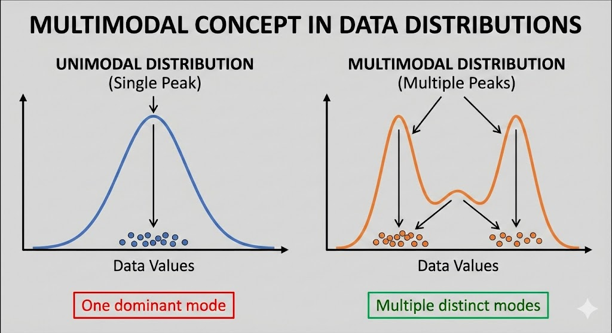

# Probabilistic World Models for Autonomous Driving

## "The Brain in the Box"

<br/>

### **The Goal:**
### Don't just teach the car to drive.
### **Teach the car to simulate reality.**

<br/>
<br/>
<br/>
<br/>
<br/>
<br/>
<br/>
<br/>
<br/>
<br/>

---

# 1. The Data Insight: How to Move

<br/>

## Problem: Absolute coordinates vary wildly.
## Solution: Learn **Pose Deltas** (Velocity).

<br/>


<br/>

### **We learn the physics of motion, not specific maps.**

<br/>
<br/>
<br/>
<br/>
<br/>
<br/>
<br/>
<br/>
<br/>
<br/>

---

# 2. Vision Model (VAE)

<br/>

## The "Eyes": Compressing images into features ($z$).

<br/>

|                       **Reconstruction (Real Input)**                        |                    **Random Sampling (Dreaming)**                     |
| :--------------------------------------------------------------------------: | :-------------------------------------------------------------------: |
|  |  |
|                            *Captures structure.*                             |                       *Blurry/Invalid states.*                        |

<br/>

### **Insight:** The latent space contains "holes" (undefined regions).

<br/>
<br/>
<br/>
<br/>
<br/>
<br/>
<br/>
<br/>
<br/>
<br/>

---

# 3. The Memory Model (MDN-RNN)

<br/>

## The "Brain": Predicting uncertain futures.

<br/>

### **Why Probabilistic? The "Fork in the Road"**
### Deterministic models average choices $\rightarrow$ Crash.

<br/>



<br/>
<br/>
<br/>
<br/>
<br/>
<br/>
<br/>
<br/>
<br/>
<br/>

---

# 4. The Architecture

<br/>

## Combining Memory + Uncertainty + Movement

<br/>

```mermaid
graph TD
    Zt["Visual Input (z_t)"] --> LSTM[LSTM Core (Context/Memory)]

    LSTM --> GMM["VISION HEAD : Probabilistic Future : P(z_t+1 | z_t)"]

    LSTM --> Pose["POSE HEAD : Movement Delta : (Δx, Δy, Δθ...)"]
```

<br/>
<br/>
<br/>
<br/>
<br/>
<br/>
<br/>
<br/>
<br/>
<br/>

---

# 5. Results: Trajectory Prediction

<br/>

## Open-Loop Testing
### (Model sees ground truth at every step)

<br/>


<br/>

### ⚠️ **Pretty accurate, realistic physics, but not good**

<br/>
<br/>
<br/>
<br/>
<br/>
<br/>
<br/>
<br/>
<br/>
<br/>

---

# 6. The Power of "Dreaming"

<br/>

## Closed-Loop Simulation
### (Model feeds its own predictions back forever)

<br/>


<br/>

### ⚠️ **Drifts a lot from start.**
### *Not stable enough for 5-10 second planning horizons.*

<br/>
<br/>
<br/>
<br/>
<br/>
<br/>
<br/>
<br/>
<br/>
<br/>

---

# Conclusion

<br/>

## We built a functional World Model:

### 1. **Compresses** vision (VAE).
### 2. **Remembers** context (RNN).
### 3. **Simulates** uncertain futures (MDN).

<br/>

## **Next Step: Model-Based RL**
### Train a driving agent entirely inside this safe simulation.